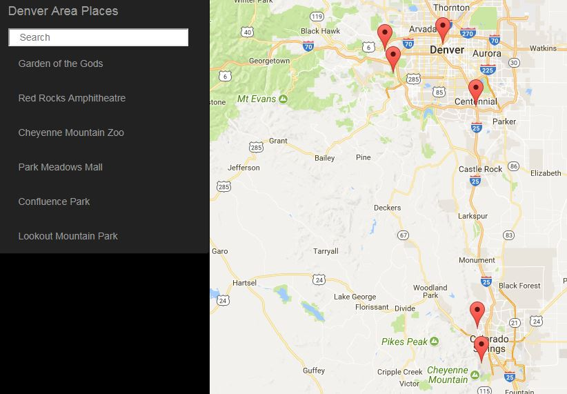

# Denver Area Map
by robotoART

### Objective of this sample application
Using a basic sample Google Maps API project from Udacity's GitHub pages demonstrate the fundamentals of creating a single page Web application. Discover more about JSON endpoints using jQuery AJAX asynchronously, and how to efficiently adapt when an applications scope or requirements change. Learn about Organizational Libraries & Frameworks like Knockout.js, Cross-Origin Resource Sharing (CORS), separation of concerns principles such as Model View ViewModel (MVVM), and implementation of third party APIs including Foursquare, Yelp, Instagram, and others found in this project.

**Udacity's sample projects:** Here's a list of example projects that guided the making of the Denver Area Map Web App:

* [AJAX New York Times and Wikipedia APIs](https://www.udacity.com/api/nodes/3137588543/supplemental_media/udacity-ajax-completezip/download)
* [Cat Clicker with knockout.js](https://github.com/udacity/ud989-cat-clicker-ko-starter)
* [todo MVC app](https://github.com/udacity/ud989-todo-app)
* [Google Maps API app](https://github.com/udacity/ud864)

# Requirements to Run Application

### Node.js

If you don't already have Node.js installed, [download Node.js from nodejs.org.](https://nodejs.org/en/download/) Install the version for your operating system.

### npm

NPM is normally included with Node.js, but just to make sure it is please follow the instructions from the developers from, [npmjs.com.](https://www.npmjs.com/get-npm).

### Bower

After making sure Node.js and npm are installed then install bower following these instructions from [Bower.io.](https://bower.io/).

### Git (optional)

Git will help with the downloading, uploading, versioning, and more when collaborating on a project. Git is not needed to run this project.

If you don't already have Git installed, [download Git from git-scm.com.](http://git-scm.com/downloads) Install the version for your operating system.

On Windows, Git will provide you with a Unix-style terminal and shell (Git Bash).  
(On Mac or Linux systems you can use the regular terminal program.)

## Download or Clone this project

### Download
At the top right corner of the [GitHub DenverAreaMap main page](https://github.com/robotoART/DenverAreaMap), just click on the large green "Clone or Download" button and follow the steps.

### Clone (optional)
**Windows:** Use the Git Bash program (installed with Git) to get a Unix-style terminal.  
**Other systems:** Use your favorite terminal program.

Using the terminal, change directory to wherever you want the project to reside.

From the terminal, run:

    git clone https://github.com/robotoART/DenverAreaMap

This will give you a directory named **DenverAreaMap** with a **index.html** file, all css & javascript files, and a bower.json file for installing all of the necessary components to run and customize the project.

## Running the Denver Area Map App
Once all the requirements listed above are installed and you have downloaded or cloned a copy of the App there's one last step.

### Install Bower Components
Using a terminal or command prompt change into the **DenverAreaMap** directory and run command:

    bower install

Now you can run the app on localhost:8080 by setting up a local server with Python.

* Python 3.x :    python -m http.server 8080
* Python 2.x :    python -m SimpleHTTPServer 8080

Google Chrome is the preffered browser to run this app.

The app will open a Google Maps API of the Denver, CO area with a handful of markers to some great places to visit within an hour of the city. Simply type in a few key letters of a place to see if it's on the list.

Thanks for looking.
